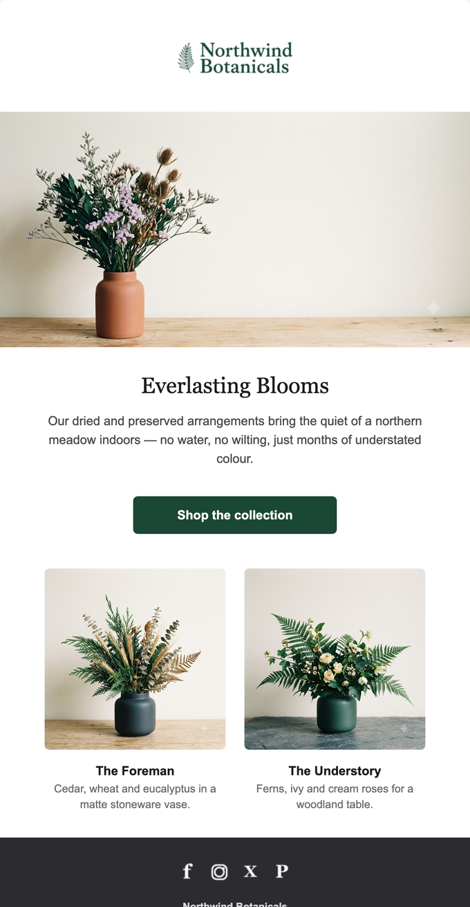
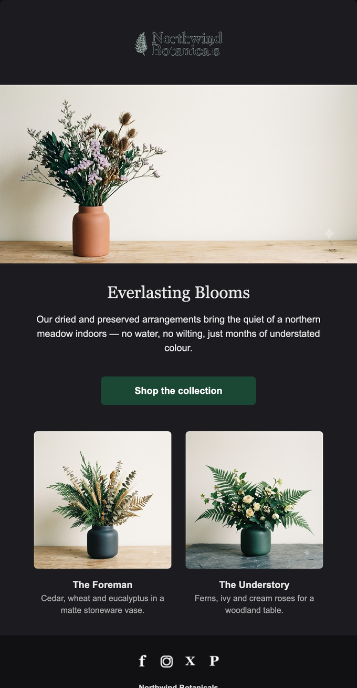
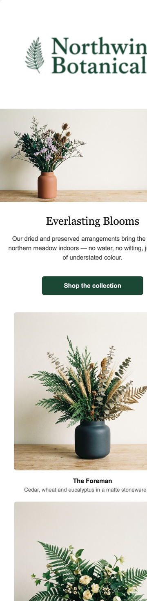

# Cross-Client HTML Email Framework

A hand-authored HTML email template and reference built on one principle:

> **Never drop support for a client while a single real person still uses it.**

Most modern email frameworks quietly abandon the awkward clients — old Outlook,
Android 4's stock mail, Windows Phone — because supporting them is tedious. This
project does the opposite. It began in 2014 as "the most cross-compatible
template you'll find anywhere," and it is now maintained to cover **both** the
2014 client landscape **and** everything that appeared since: dark mode, the new
Chromium-based Outlook, Apple Mail Privacy Protection, one-click unsubscribe,
and the accessibility expectations of VoiceOver/TalkBack.

It is three things at once:

1. **A production template** you can ship today.
2. **A reference** — every cross-client hack is documented inline and explained
   in the [quirks table](#the-quirks-reference) below, so you can learn *why*,
   not just copy.
3. **A framework** — modular partials, a single-file master, or an optional
   zero-dependency build. Use whichever fits your workflow.

---

## Preview

| Light | Dark | Mobile |
|:---:|:---:|:---:|
|  |  |  |

The same `framework/template.html` rendered in light, dark, and on a narrow
screen — one source, no per-client forks. (Screenshots are the Blink render; see
[Testing](#testing) for real-client verification.)

---

## What's in the box

```
html-email/
├── framework/                 ← the maintained, modern template (start here)
│   ├── template.html          ← single-file master, fully commented (copy & fill in)
│   ├── partials/              ← the same template as documented components
│   ├── build/                 ← optional Node assembler (no MJML, no fidelity loss)
│   │   ├── build.mjs
│   │   └── content.json       ← your copy/links; `npm run build` → dist/
│   ├── dist/                  ← built output (email.html + email.min.html)
│   └── assets/                ← sample images (logo, hero, products, icons)
│
├── examples/
│   ├── northwind-botanicals/  ← the template filled out as a real campaign
│   └── campaigns-2014/        ← original 2014 campaigns, kept as references
│
└── legacy/                    ← preserved, unmodified 2014 artifact
    ├── campaign.html          ← the original skeleton, exactly as written in 2014
    └── checklist/             ← the original interactive best-practice checklist
```

The **legacy** folder is a historical artifact — see [legacy/README.md](legacy/README.md).
Everything new lives in **framework**.

---

## Three ways to use it

### 1. Copy the single file
Open [`framework/template.html`](framework/template.html). It is the whole email
in one commented file with `{{placeholders}}` where your content goes. Replace
the placeholders (by hand or with your ESP's merge tags); everything is already
inlined. Done.

### 2. Assemble the partials
[`framework/partials/`](framework/partials) breaks the template into components —
`00-document-open`, `header`, `hero`, `columns`, `button`, `footer`,
`99-document-close`. Each is a standalone, heavily commented snippet. Paste the
ones you need in order, duplicate `40-columns` for more rows, and skip the rest.

### 3. Build it
Zero dependencies, Node ≥ 16:

```bash
cd framework/build
node build.mjs                 # inject content.json  → ../dist/email.html
node build.mjs --production    # + minify (strips docs, keeps MSO comments)
node build.mjs --skeleton --out ../template.html   # regenerate the fill-in master
```

The build **only concatenates the hand-tuned partials and substitutes your
content**. It is not MJML: there is no compiler translating a shorthand into
HTML, so nothing is lost in translation on the oldest clients. Copy-paste and
build produce identical markup by design.

---

## Integrating with your ESP

- **Merge tags.** Leave your platform's tokens in the content, e.g. Mailchimp
  `*|FNAME|*`, `*|UNSUB|*`, `*|ARCHIVE|*`; the framework doesn't touch them. The
  sample `content.json` already uses Mailchimp-style unsubscribe/archive tokens.
- **CSS inlining.** The template keeps a `<style>` block for media queries and
  dark mode (which *cannot* be inlined) and inlines everything else already. If
  your ESP auto-inlines, that's fine — inlining the presentational styles is
  belt-and-braces for clients that strip `<style>` (Gmail when a message is
  clipped or forwarded).
- **Stay under 102 KB.** Gmail clips messages larger than ~102 KB, hiding your
  footer and unsubscribe link. `--production` strips documentation comments and
  collapses whitespace to keep you well under; the build prints a warning if you
  cross the line.
- **One-click unsubscribe (2024+).** Gmail and Yahoo now require bulk senders to
  support RFC 8058 one-click unsubscribe. That is set via the `List-Unsubscribe`
  and `List-Unsubscribe-Post` *headers* (your ESP sends these), plus a real,
  working unsubscribe link in the footer — which this template includes.
- **Host images absolutely.** Email cannot use relative image paths. Upload
  `assets/` to your CDN/ESP and use absolute `https://` URLs. Always keep the
  `alt` text — Outlook blocks images by default and many people read with images
  off.

---

## Platform support matrix

Coverage target: **every client with real-world usage, current or legacy.**
Market-share figures are Litmus, May 2026 (≈1B opens).

| Client | Rendering engine | Status | Notes |
|---|---|---|---|
| **Apple Mail** — macOS | WebKit | ✅ Full | 64.66% of all opens (incl. iOS). Dark mode via `prefers-color-scheme`. |
| **Mail** — iOS / iPadOS | WebKit | ✅ Full | Auto-linking & auto-scaling neutralised (see quirks 13–15). |
| **Gmail** — webmail | Google | ✅ High | Runs its own dark-mode inversion (quirk 8); strips `<style>` over 8KB or with any CSS error (quirk 27); desktop ignores media queries (quirk 28). |
| **Gmail app** — iOS / Android (Google & non-Google accounts) | Google | ✅ High | Since 2016 `<style>` is honoured; keep inline styles as backup. |
| **Outlook** — Windows, *classic* 2007–2021 | **Word** | ✅ Supported | The hard one. VML buttons/backgrounds, ghost tables, 96-DPI fix. Retires Oct 2026 but the installed base persists. |
| **Outlook** — Windows, *new* ("Monarch") | Chromium | ✅ Full | Default since 2024. Modern CSS; ignores MSO comments, so it uses the standard code path. |
| **Outlook.com** — web | Chromium-class | ✅ High | Partial dark-mode inversion via `[data-ogsc]`/`[data-ogsb]` (quirk 11). |
| **Outlook** — macOS | WebKit | ✅ Full | |
| **Outlook** — iOS / Android app | Custom | ✅ High | |
| **Yahoo Mail / AOL** | Shared platform | ✅ High | Honours `<style>` and media queries; explicit units required. |
| **Samsung Mail** | AOSP-derived | ✅ High | Supports `prefers-color-scheme`; inflates undersized text. |
| **Android stock / AOSP mail (4.x)** | WebKit | ✅ Via fluid-hybrid | No media-query support — layout still adapts because it never depended on them (quirk 21). |
| **Windows Phone 7/8 mail** | IE (Trident) | ✅ Supported | `X-UA-Compatible`, viewport, no unsupported CSS relied upon. |
| **Windows 10/11 Mail** | EdgeHTML/Chromium | ✅ High | |
| **Thunderbird** | Gecko | ✅ Full | |
| **BlackBerry / legacy mobile** | Various | ✅ Graceful | Single-column fallback, styled alt text, semantic order. |
| **ProtonMail / Fastmail / Hey** | Modern web | ✅ High | Strip/rewrite some CSS; template degrades cleanly. |

---

## The quirks reference

Each row is a real rendering behaviour the template defends against. The number
links to a full explanation below. "Where" names the worst offender; several
quirks affect more than one client.

| # | Quirk | Where it bites | How the framework handles it |
|---|---|---|---|
| 1 | Word rendering engine (no `max-width`, `float`, `margin` on many elements) | Outlook Windows (classic) | Ghost tables + fixed widths inside `[if mso]` |
| 2 | 120/144-DPI image & width upscaling | Outlook Windows | `<o:PixelsPerInch>96` in an MSO `<xml>` block |
| 3 | Web fonts fall back to Times New Roman | Outlook Windows | `[if mso]` style forces an Arial stack |
| 4 | `<a>` ignores padding & `border-radius` (dead click area) | Outlook Windows | VML `<v:roundrect>` button, dual-built with a normal `<a>` |
| 5 | No `max-width` → layout won't center/constrain | Outlook Windows | 600px MSO ghost table wrapping a fluid `.email-container` |
| 6 | No CSS background images | Outlook Windows (classic); *partial* in Outlook.com & Yahoo | VML `v:fill type="frame"` for Outlook; solid `bgcolor` fallback always behind |
| 7 | Message clipped at ~102 KB (footer/unsub hidden) | Gmail | `--production` minify; build warns past the threshold |
| 8 | Runs its own dark-mode inversion, ignores `prefers-color-scheme` | Gmail | Explicit `bgcolor` on **every** cell so nothing is left "unset" |
| 9 | Inverts pure `#000000` / `#ffffff` unconditionally | Apple Mail (dark) | Off-black `#2b2b30` / off-white text; `supported-color-schemes` meta |
| 10 | `prefers-color-scheme` support is inconsistent | Cross-client | Progressive enhancement + `color-scheme` meta; never depended on |
| 11 | Partial colour inversion, custom attributes | Outlook.com (dark) | `[data-ogsc]` (text) / `[data-ogsb]` (background) targeted overrides |
| 12 | Undefined `<td>` background repainted dark | Gmail (dark) | Same as #8 — no cell without an explicit colour |
| 13 | Auto-links dates, phones, addresses in blue | iOS Mail | `format-detection` meta + `a[x-apple-data-detectors]` reset |
| 14 | Auto-inflates "too small" text | iOS, Windows | `-webkit-text-size-adjust` / `-ms-text-size-adjust:100%` |
| 15 | Auto-scales/reformats the whole layout | Apple Mail | `x-apple-disable-message-reformatting` meta |
| 16 | 3px phantom gap under images | Most clients | `display:block` on every `` |
| 17 | Extra space injected around tables | Outlook | `mso-table-lspace/rspace:0` + `border-collapse` |
| 18 | `.ExternalClass` alters line-height/width | Outlook.com | `.ExternalClass` line-height + width resets |
| 19 | Images blocked by default | Outlook, others | Real `alt` on every image; coloured cell fallbacks; text is never in images |
| 20 | Blurry images on high-DPI screens | Retina/HiDPI | 2× source images constrained to half display width |
| 21 | No media-query support | Android 4.x stock, some Samsung | **Fluid-hybrid**: inline-block columns that wrap without a media query |
| 22 | Legacy Trident quirks | Windows Phone 7/8 | `X-UA-Compatible=IE=edge`, viewport, no reliance on modern CSS |
| 23 | Layout tables announced to screen readers; no doc landmark | VoiceOver / TalkBack | `role="presentation"` on layout tables, `role="article"`, `lang`, semantic `alt` |
| 24 | Inbox preview scrapes the first visible text | All | Hidden preheader + zero-width-space spacer run |
| 25 | Non-exact line-height adds leading | Outlook | `mso-line-height-rule:exactly` |
| 26 | Unstyled background gutters | All | Background colour on both `<body>` and the wrapper table |
| 27 | Strips the **entire** `<style>` block if it exceeds 8192 chars or contains any CSS error | Gmail | Keep the block small and valid; the linter fails the build past 8 KB or on unbalanced braces |
| 28 | Desktop webmail ignores `@media` queries | Gmail (web) | Fluid-hybrid layout (quirk 21) adapts without media queries; the `@media` block is enhancement only |

### Explanations

**1 — The Word rendering engine.** From Outlook 2007 through classic Outlook 2021
on Windows, Microsoft renders email with the *Microsoft Word* HTML engine, not a
browser. Word ignores `max-width`, `float`, `display:inline-block`, CSS
background images, and much of the box model. The framework never fights this: it
gives Word its own reality inside `<!--[if mso]>` conditional comments — fixed-
width "ghost" tables — while every other client uses modern, fluid CSS. This is
the root of most rules below.

**2 — DPI upscaling.** On high-DPI Windows, Word scales the whole email by the
system DPI (125% or 150%), stretching images and blowing out fixed widths. The
`<o:OfficeDocumentSettings><o:PixelsPerInch>96</o:PixelsPerInch>` block, wrapped
in `[if mso]`, pins rendering to 96 DPI (1:1). `AllowPNG` keeps PNG transparency
from being flattened to a grey box.

**3 — Times New Roman fallback.** Word has no `@font-face` support and, worse,
falls back to *Times New Roman* rather than a sans-serif. An `[if mso]` style
block forces `font-family: Arial, Helvetica, sans-serif !important` so brand type
degrades to a clean sans everywhere in Outlook.

**4 — Bulletproof buttons.** A padded, rounded `<a>` is a link with no clickable
body in Word — only the text is clickable and there are no rounded corners. The
fix is a dual build: a VML `<v:roundrect>` (a real vector rectangle, fully
clickable, with `arcsize` for the radius) inside `[if mso]`, and a normal styled
`<a>` inside `[if !mso]`. Exactly one renders per client. See `partials/50-button.html`.

**5 — Constraining width without `max-width`.** Word ignores `max-width`, so a
`max-width:600px` container would run full-bleed. The template wraps the fluid
container in a 600px-wide MSO ghost table; Word obeys the table width, modern
clients obey `max-width` and stay fluid below 600px.

**6 — Background images.** Classic Outlook (Word) supports no CSS
`background-image`. Where you need one (a hero with text baked over a photo), VML
`v:rect` + `v:fill type="frame"` + `v:textbox` draws it for Outlook; every other
client uses the CSS background. Gmail and Apple Mail support background images
fully; Outlook.com and Yahoo support them only *partially* — so a solid `bgcolor`
must always sit behind, or those clients show an empty box. The full snippet is
in [Text over a background image](#text-over-a-background-image), and it ships as
`partials/35-hero-bg.html`.

**7 — Gmail's 102 KB clip.** Gmail truncates a message past ~102 KB and shows a
"[Message clipped]" link — hiding whatever is at the bottom, typically your
unsubscribe link (a compliance problem) and footer. Keep emails small; the
`--production` build strips documentation comments (but never the functional MSO
conditional comments) and collapses whitespace, and warns you if you exceed the
threshold.

**8 & 12 — Gmail dark mode.** Gmail does not read `prefers-color-scheme`; it runs
its own algorithm (brightness thresholds then CIELAB inversion on Android, fuller
inversion on iOS). The single biggest cause of broken Gmail dark mode is a `<td>`
with *no* background colour — Gmail treats "unset" as fair game and paints its own
dark fill, often behind dark text. The defence is in the markup, not CSS: give
**every** cell an explicit `bgcolor`. The template does.

**9 — Apple Mail inverts pure black/white.** In dark mode Apple Mail forcibly
inverts pure `#000000` and `#ffffff` regardless of your intent. Using off-values
(`#2b2b30` background, `#d8d8d8`/`#e6e6e6` text — as the footer does) sidesteps
the forced swap; the difference is invisible in light mode. The
`supported-color-schemes` meta also tells Apple you've handled both modes, so it
won't blanket-invert.

**10 — `prefers-color-scheme` is not universal.** It's honoured by Apple Mail,
iOS Mail, Outlook for Mac, new Outlook, Samsung Mail and Thunderbird — and ignored
by Gmail and older clients. The template treats it as *enhancement*: the light
design is complete and correct on its own, and dark styles layer on top for
clients that support them. The `color-scheme: light dark` meta signals intent.

**11 — Outlook.com dark mode.** Outlook's webmail and apps partially invert
colours and expose two attributes you can target: `data-ogsc` (original-get-style-
colour, i.e. text) and `data-ogsb` (background). The template ships
`[data-ogsc] .darkmode-text { … }` / `[data-ogsb] .darkmode-bg { … }` overrides so
you control the result instead of accepting Outlook's guess.

**13 — iOS auto-linking.** iOS turns anything that looks like a date, phone
number, or address into a blue, underlined link. The `format-detection` meta
(`telephone=no,date=no,address=no,email=no`) suppresses most of it; the
`a[x-apple-data-detectors]` reset re-inherits colour/weight/size for any link iOS
creates anyway (e.g. in the footer address).

**14 — Text-size adjustment.** iOS and Windows clients "helpfully" enlarge text
they think is too small, breaking tuned layouts. `-webkit-text-size-adjust:100%`
and `-ms-text-size-adjust:100%` (on `*`) disable it.

**15 — Apple Mail reformatting.** Apple Mail may auto-scale an email to fit,
shrinking your careful 600px layout. `<meta name="x-apple-disable-message-reformatting">`
turns that off.

**16 — The image gap.** Inline images sit on the text baseline, leaving a ~3px
gap beneath them that shows as a hairline in coloured cells. `display:block` on
every `` removes it.

**17 — Outlook table spacing.** Word adds ~1px of left/right space around tables
and cells. `mso-table-lspace:0pt; mso-table-rspace:0pt` plus
`border-collapse:collapse` removes the seams that otherwise appear between
adjacent cells.

**18 — `.ExternalClass`.** Outlook.com/Windows Live wraps your email in a
`.ExternalClass` element and applies its own `line-height`, adding vertical
padding. Forcing `.ExternalClass { width:100% }` and `line-height:100%` on its
children restores your spacing.

**19 — Blocked images.** Outlook (and cautious users everywhere) block images by
default. Two defences: (a) every image carries meaningful `alt` text so the email
still communicates, and (b) no essential copy ever lives inside an image — the
hero *headline* may be an image for brand type, but the message paragraph is
always live HTML. Coloured cell backgrounds sit behind images so blocked images
don't leave white holes.

**20 — Retina.** On 2×/3× displays a 300px image drawn at 300px looks soft.
Export images at twice the display size and constrain them with a `width`
attribute (Outlook) and `max-width` CSS (everyone else) — the sample product
tiles are 462px files shown at 231px.

**21 — Fluid-hybrid (the "spongy" pattern).** The Android 4.x stock mail app and
some Samsung builds don't support media queries at all. Rather than depend on
them, columns are `display:inline-block` with a `max-width`: on a wide screen two
sit side-by-side; on a narrow one they naturally wrap to full width — *no media
query required*. The `@media` block is then a refinement, not a crutch, and
Outlook gets ghost-table columns. This is why the layout adapts even where
responsive CSS is unavailable.

**22 — Windows Phone / legacy Trident.** Older Windows mail clients use the IE
engine. `X-UA-Compatible=IE=edge` selects the newest available mode, the viewport
meta enables mobile scaling, and the layout leans on tables (universally
supported) rather than modern CSS these engines lack.

**23 — Accessibility (new since 2014).** Screen readers announce every `<table>`
as tabular data — dozens of "table, row 1 of 1" interruptions in a table-based
email. `role="presentation"` on each *layout* table silences that. `role="article"`
+ `aria-label` + `lang` give the email a proper document landmark, and every image
has descriptive `alt`. None of this mattered in 2014; all of it is expected now.

**24 — Preheader.** Inboxes show a preview line after the subject; with no
dedicated text they scrape the first visible content (often "View in browser").
A visually hidden `<div>` supplies intentional preview text, followed by a run of
`&zwnj;&nbsp;` zero-width characters that pushes the real body out of the preview
so only your line shows.

**25 — Exact line-height.** Word applies its own leading above text lines unless
told otherwise. `mso-line-height-rule:exactly` (set globally in the MSO style and
on text cells) makes line-height mean exactly what you wrote.

**26 — Background gutters.** If only the wrapper table has a background colour,
some clients show the client's default (often white) around it; if only `<body>`
has it, others ignore it. Setting the colour on **both** `<body>` and the wrapper
guarantees no unstyled gutter in any client.

**27 — Gmail's all-or-nothing `<style>` parsing.** Gmail supports embedded CSS
(media queries, dark mode) — but only in `<head>`, and it drops the *entire*
`<style>` block the moment it exceeds **8192 characters** or hits a single CSS
error (an unclosed brace, an invalid property). There is no partial parse: one
mistake and you lose dark mode and responsive styling in Gmail at once. The
framework keeps its main block at ~4.8 KB, and `npm run lint` fails the build if
it ever crosses 8 KB or the braces don't balance.

**28 — Desktop Gmail ignores media queries.** Gmail's *desktop webmail* does not
apply `@media` rules (the mobile apps do). An email that depends on a media query
to become single-column would stay wide and broken in desktop Gmail. This project
never depends on them: the fluid-hybrid columns (quirk 21) reflow on their own,
and the `@media` block only refines the result where it is supported.

### Text over a background image

The one snippet too dangerous to keep inside a documentation comment (nested HTML
comments are illegal). This renders a background image *behind text* in classic
Outlook via VML, with a normal CSS background everywhere else:

```html
<td background="hero-bg.jpg" bgcolor="#1b4735" valign="top" style="background-image:url('hero-bg.jpg'); background-size:cover;">
  <!--[if gte mso 9]>
  <v:rect xmlns:v="urn:schemas-microsoft-com:vml" fill="true" stroke="false" style="width:600px; height:300px;">
    <v:fill type="frame" src="hero-bg.jpg" color="#1b4735" />
    <v:textbox inset="0,0,0,0">
  <![endif]-->
  <div>
    <!-- your overlaid text table goes here -->
  </div>
  <!--[if gte mso 9]>
    </v:textbox>
  </v:rect>
  <![endif]-->
</td>
```

---

## Testing

**Lint before you look.** The framework enforces its own rules — run it on any
built email:

```bash
cd framework/build
npm run lint        # or: node lint.mjs ../dist/email.html
npm run verify      # build + lint in one step
```

`lint.mjs` fails the build if the file exceeds Gmail's 102 KB clip, if the
`<style>` block passes Gmail's 8 KB strip limit or has unbalanced braces, if any
image lacks `alt`, if MSO conditional comments don't balance, or if the
unsubscribe link is missing — and warns on missing `role="presentation"` and
unguarded pure black/white. It turns the quirks above from advice into a gate.

Then, because rendering can't be trusted to one machine, before every send:

- **Litmus** or **Email on Acid** for the full client grid (both cover classic
  *and* new Outlook, Gmail dark mode, Apple Mail, Samsung).
- **[caniemail.com](https://www.caniemail.com/)** to check any CSS feature's
  support before you rely on it.
- Send a real test to yourself and open it in **Gmail (light + dark)**,
  **Apple Mail (light + dark)**, and **Outlook (classic + new)** at minimum —
  these three cover >95% of opens and the widest behavioural spread.

---

## The 2014 artifact

The original template and its interactive best-practice checklist are preserved,
unmodified, in [`legacy/`](legacy/). They are kept as a historical reference for
how this problem was solved a decade ago — and because the core approach (tables,
inline styles, MSO conditionals, progressive enhancement) has proven remarkably
durable. See [legacy/README.md](legacy/README.md).

---

## Sources

Client behaviour and market data verified against:

- [Litmus — Email Client Market Share (May 2026)](https://www.litmus.com/email-client-market-share)
- [Email on Acid — Will the New Outlook be Better for Developers?](https://www.emailonacid.com/blog/article/industry-news/new-outlook-for-windows/) (Word→Chromium transition, Oct 2026 retirement)
- [Litmus — Guide to Rendering Differences in Microsoft Outlook](https://www.litmus.com/blog/a-guide-to-rendering-differences-in-microsoft-outlook-clients)
- [Litmus — Ultimate Guide to Dark Mode for Email](https://www.litmus.com/blog/the-ultimate-guide-to-dark-mode-for-email-marketers)
- [Email on Acid — Dark Mode for Email](https://www.emailonacid.com/blog/article/email-development/dark-mode-for-email/)
- [Can I email…](https://www.caniemail.com/) — CSS/HTML feature support database

---

## License

MIT — use it, adapt it, ship it. Attribution appreciated, not required.
