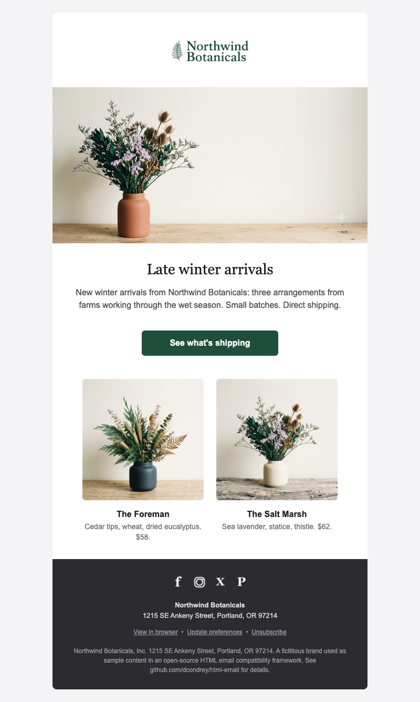
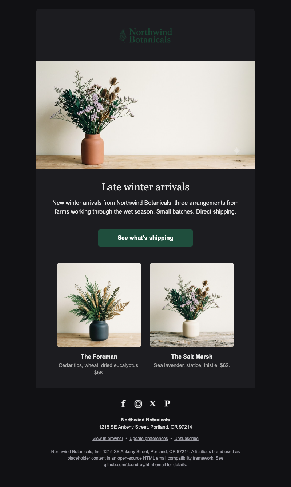
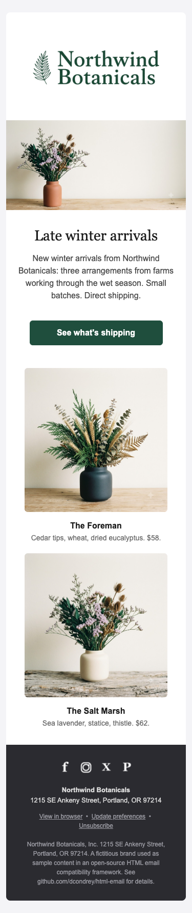
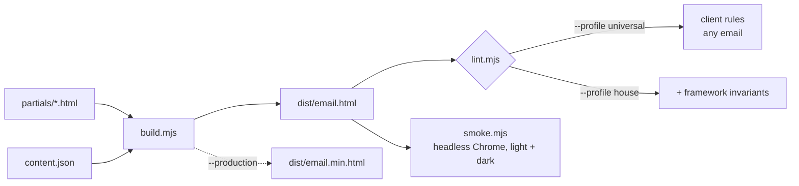
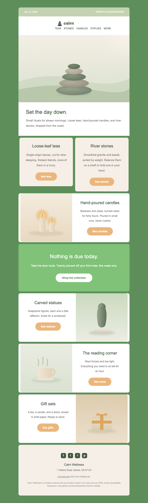
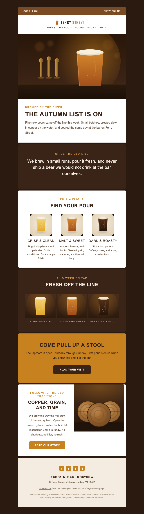
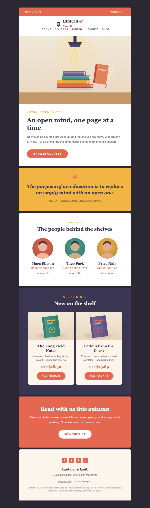
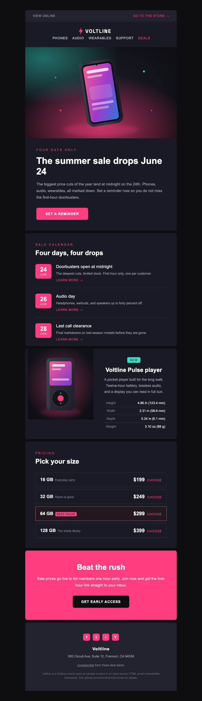
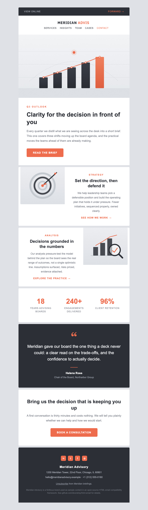

<!-- html-email: a hand-authored, zero-dependency cross-client HTML email framework. Project landing README. -->


<h1>html-email</h1>
<p><strong>HTML email that renders everywhere — classic Outlook to dark mode — with no compiler in the way.</strong></p>

<br clear="left">

<!-- Badge palette: dynamic health; metadata #007ec6; standards #6a4c93; label #20232a; platform brand colors. -->

<p align="center">
  <a href="https://github.com/dcondrey/html-email/actions/workflows/ci.yml"></a>
  <a href="https://github.com/dcondrey/html-email/actions/workflows/codeql.yml"></a>
  <a href="https://scorecard.dev/viewer/?uri=github.com/dcondrey/html-email"></a>
  <a href="./.bestpractices.json"></a>
  <a href="https://slsa.dev"></a>
  <a href="#quickstart"></a>
  <a href="https://nodejs.org"></a>
  <a href="./LICENSE"></a>
  <a href="./CODE_OF_CONDUCT.md"></a>
  <a href="https://dcondrey.github.io/html-email/"></a>
  <a href="https://github.com/sponsors/dcondrey"></a>
</p>

<p align="center">
  <a href="#quickstart">Quickstart</a> &middot;
  <a href="#why-html-email">Why</a> &middot;
  <a href="#how-it-builds">How it builds</a> &middot;
  <a href="#lint-any-email">Lint any email</a> &middot;
  <a href="#templates">Templates</a> &middot;
  <a href="#documentation">Docs</a>
</p>

---

## Quickstart

Node ≥ 16. No install needed to build or lint.

```bash
git clone https://github.com/dcondrey/html-email.git && cd html-email

node framework/build/build.mjs                                   # partials + content.json -> framework/dist/email.html
node framework/build/lint.mjs --profile house framework/dist/email.html
```

That is the whole loop. `npm ci` is only needed for screenshots (`npm run previews`) and the render smoke-test (`npm run smoke`).

> [!TIP]
> Three ways in, all producing identical markup: copy [`framework/template.html`](framework/template.html) (one commented file with `{{placeholders}}`), paste the components you need from [`framework/partials/`](framework/partials), or run the build above.

## Why html-email

Most frameworks quietly drop the awkward clients because supporting them is tedious. This one does not. It began in 2014 as "the most cross-compatible template you'll find anywhere" and now covers **both** that client landscape **and** everything since.

| | What it means |
| --- | --- |
| **Never drop support** | No workaround breaks an older client to help a newer one. [28 documented quirks](./docs/quirks.md), defended in the markup and enforced by 28 lint rules. |
| **Zero dependencies** | A ~120-line `build.mjs` concatenates partials and injects `content.json`. No MJML, no compiler, no fidelity loss. Puppeteer and fast-check are dev-only. |
| **Verified, not just authored** | The linter gates the HTML, a [self-test](./framework/build/lint.test.mjs) gates the linter, a [fuzzer](./framework/build/fuzz.test.js) gates its edge cases, and [`smoke.mjs`](./scripts/smoke.mjs) gates the actual render in headless Chrome. |
| **Works on anyone's email** | The default rule set is client behaviour every email is subject to, not this project's conventions. Point it at MJML, React Email, or Maizzle output. |
| **Dark mode, three ways** | `prefers-color-scheme`, Outlook.com `[data-ogsc]`/`[data-ogsb]`, and an explicit `background-color` on every container the dark CSS repaints. |

<div align="center">

| Desktop — light | Desktop — dark | Mobile |
|:---:|:---:|:---:|
|  |  |  |

</div>

### Against the compiler frameworks

Checked against each project's own documentation, 2026-08-22. These are all good
tools; the axis that separates them is whether a compiler stands between you and the
markup that ships.

| | **html-email** | [MJML](https://github.com/mjmlio/mjml) | [Maizzle](https://maizzle.com) | [React Email](https://github.com/resend/react-email) |
|---|:-:|:-:|:-:|:-:|
| You author | HTML | `<mj-*>` markup language | Vue SFCs + Tailwind | React/JSX components |
| Build step to get HTML | optional (concatenation only) | required (compile) | required (Vite pipeline) | required (render) |
| Runtime dependencies | 0 | npm package | Node + Vite + Tailwind | Node + React |
| Ships markup you wrote | yes | no — compiler output | no — pipeline output | no — render output |
| Hand-editing the shipped HTML | expected | round-trip is lost | round-trip is lost | round-trip is lost |
| CSS inlining | not needed (styles authored in place) | automatic | configurable transformers | via Tailwind component |
| Lints *other* tools' output | yes — point it at any HTML email | no | no | no |

The trade is real and runs both ways. A compiler gives you components, scoping, and
a smaller surface to get wrong, and for a large template library that is worth a lot.
This project takes the other side: the HTML in the repository is the HTML that
arrives, so a client-specific quirk is fixed where you can see it, and nothing has to
survive a regeneration. The [28 documented quirks](./docs/quirks.md) are the reason
that trade is worth making here.

## How it builds


```mermaid
flowchart LR
    P["partials/*.html"] --> B["build.mjs"]
    C["content.json"] --> B
    B --> D["dist/email.html"]
    B -. "--production" .-> M["dist/email.min.html"]
    D --> L{"lint.mjs"}
    L -->|"--profile universal"| U["client rules<br/>any email"]
    L -->|"--profile house"| H["+ framework invariants"]
    D --> S["smoke.mjs<br/>headless Chrome, light + dark"]
```

The output is the hand-tuned partials verbatim. Nothing is translated, so nothing is lost on the oldest clients.

## Lint any email

The linter has no runtime dependencies and works on any HTML email, whatever produced it.

```bash
node framework/build/lint.mjs campaign.html          # any HTML email
node framework/build/lint.mjs --json dist/*.html     # machine-readable
node framework/build/lint.mjs --sarif campaign.html  # upload to code scanning
```

| Profile | Rules | Use for |
| --- | --- | --- |
| `universal` *(default)* | 14 rules — Gmail's 102 KB clip and 8 KB `<style>` cap, unbalanced CSS, missing `alt`/`width`, MSO conditional balance, unsubscribe link, `role="presentation"`, viewport/charset, inline images, CSS background images, dark-mode inversion risk | Any HTML email, whoever built it |
| `house` | The above **plus** 14 framework invariants — both dark-mode metas, `<o:PixelsPerInch>96`, a `prefers-color-scheme` block, `.ExternalClass`, `mso-table-lspace`, `text-size-adjust`, iOS auto-linking, Apple reformatting, Outlook.com dark mode, MSO font fallback, explicit dark backgrounds, a hidden preheader, the attribution notice | This repo's templates, or a fork of its conventions |

> [!WARNING]
> `--profile house` is what `npm run lint` and CI use. Leave it off a file in this repo and fourteen real invariants pass silently.

**Two layers.** `lint.mjs` validates the HTML; `npm run smoke` validates the *render* — it loads every build in headless Chrome, light and dark, and fails on a broken image, horizontal overflow, or page error. That is the class of bug a linter cannot see.

## Templates

Five distinct designs plus the canonical framework, each in the house conventions, each passing both gates clean.

| Template | Design |
| --- | --- |
| [`framework/`](framework/) | The canonical modern template (header · hero · columns · button · footer) |
| [`templates/cairn-wellness/`](templates/cairn-wellness/) | Wellness shop — green/cream/amber, Poppins |
| [`templates/ferry-street-brewing/`](templates/ferry-street-brewing/) | Brewery — amber/brown on dark roast, Oswald · 3-col tasting + gallery |
| [`templates/lantern-and-quill/`](templates/lantern-and-quill/) | Bookshop — coral+yellow on plum, Playfair · team + product cards |
| [`templates/voltline/`](templates/voltline/) | Electronics, dark-first — dark+pink, Space Grotesk · pricing table |
| [`templates/meridian-advisory/`](templates/meridian-advisory/) | Consulting — charcoal+coral on grey, IBM Plex Sans · quote block |
| [`examples/northwind-botanicals/`](examples/northwind-botanicals/) | The 2014 production reference, scrubbed to a fictitious brand |

<details>
<summary><b>See the five branded templates</b></summary>

<br>

| Cairn Wellness | Ferry Street Brewing | Lantern & Quill | Voltline | Meridian Advisory |
|:---:|:---:|:---:|:---:|:---:|
| [](templates/cairn-wellness/) | [](templates/ferry-street-brewing/) | [](templates/lantern-and-quill/) | [](templates/voltline/) | [](templates/meridian-advisory/) |

Brand names and imagery are fictitious mock content; the art is self-authored, generated by `scripts/`.

</details>

**Start a new one:**

```bash
node scripts/new-template.mjs acme-widgets "Acme Widgets"
```

Scaffolds partials, manifest, `content.json`, and an asset-generator stub that builds and lints `0/0` out of the box. Then retheme `00-document-open.html`, edit the copy, fill in the generator, and wire it into `package.json` and the CI/release workflows.

<details>
<summary><b>Repository layout</b></summary>

```
html-email/
├── framework/                 the maintained, modern template (start here)
│   ├── template.html          single-file master, fully commented
│   ├── partials/              the same template as documented components
│   ├── build/                 build.mjs · lint.mjs/rules.mjs · tests · content.json
│   ├── dist/                  built output (email.html + email.min.html)
│   └── assets/                sample images
│
├── templates/                 five distinct branded designs, house conventions
├── examples/                  northwind-botanicals + the original 2014 campaigns
├── scripts/                   build-template.mjs, preview + asset generators
├── tools/                     email-checklist/ — self-contained pre-send checklist
├── docs/                      quirks reference, client matrix, testing, previews
└── legacy/                    the preserved, unmodified 2014 artifact
```

</details>

<details>
<summary><b>Supply chain &amp; provenance</b></summary>

<br>

Actions are pinned to full commit SHAs. **CodeQL**, **Dependency Review**, **OpenSSF Scorecard**, and **Dependabot** run in CI. Tagged releases publish a signed [SLSA](https://slsa.dev) build-provenance attestation over the release archive (see [`release.yml`](.github/workflows/release.yml)):

```bash
gh attestation verify html-email-<tag>.zip --repo dcondrey/html-email
```

Security policy and private reporting: [SECURITY.md](./SECURITY.md).

</details>

## Documentation

| Guide | What's in it |
| --- | --- |
| [Quirks reference](./docs/quirks.md) | The 28 cross-client behaviours the framework defends against, each explained |
| [Platform support](./docs/clients.md) | The client matrix and market data |
| [Testing & ESP integration](./docs/testing.md) | Linting, real-client verification, merge tags, one-click unsubscribe |
| [Pre-send checklist](./tools/email-checklist/index.html) | A zero-dependency checklist covering setup → design → build → test → send |

[Contributing](./CONTRIBUTING.md) · [Security](./SECURITY.md) · [Changelog](./CHANGELOG.md)

## License

MIT — use it, adapt it, ship it commercially, no permission needed. © 2014-2026 David Condrey.

MIT asks one thing in return: **keep the copyright notice**. Every built email carries it for you,
as a 178-byte comment after the doctype that survives the production minifier and is invisible to
recipients. Complying is automatic — just don't strip it.

Shipping something built on this? A credit line is not required, but it is what keeps the oldest
clients supported:

> Email templates by [html-email](https://github.com/dcondrey/html-email), MIT Licensed.

Details, and what you explicitly do *not* need permission for, in [NOTICE](./NOTICE).
